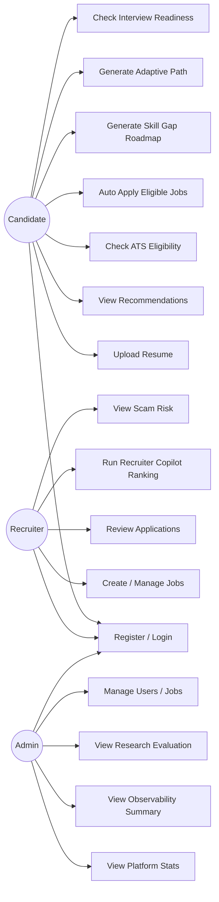
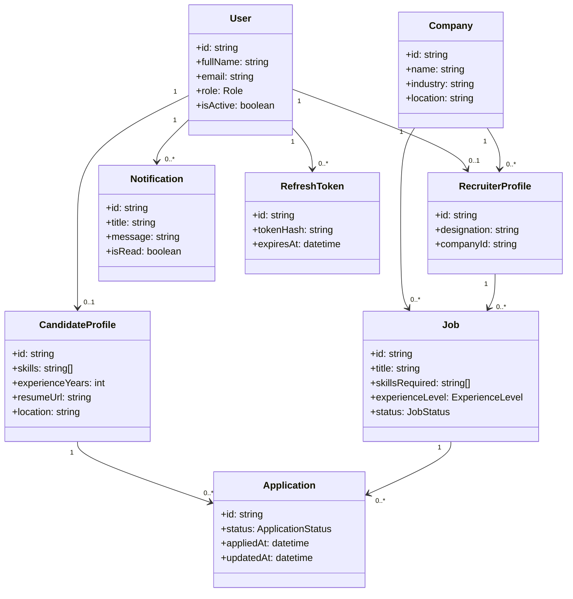
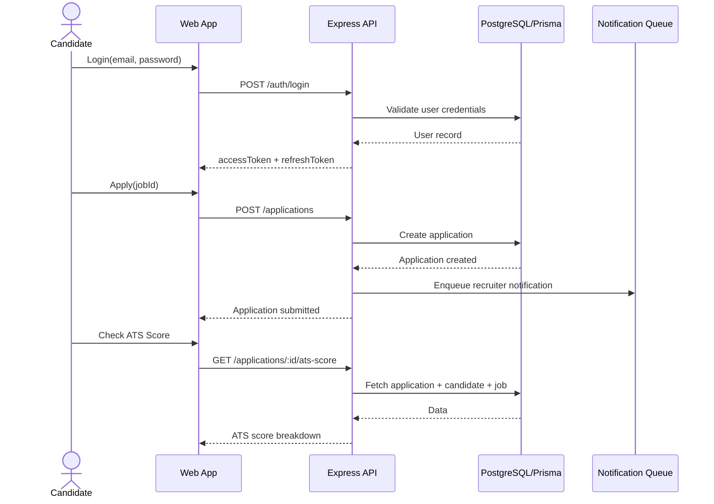
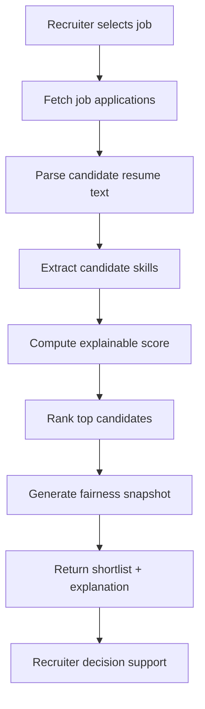
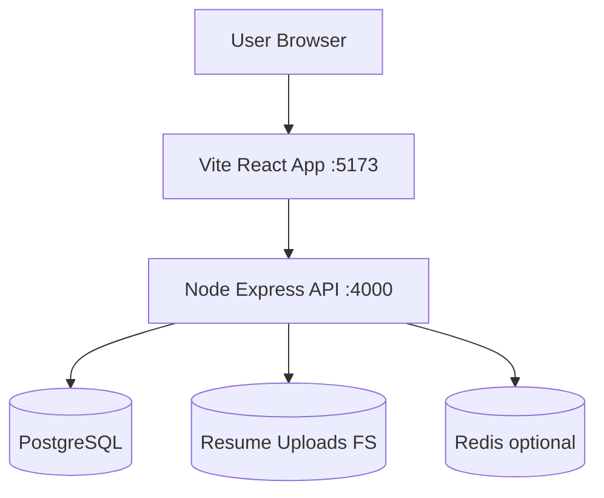
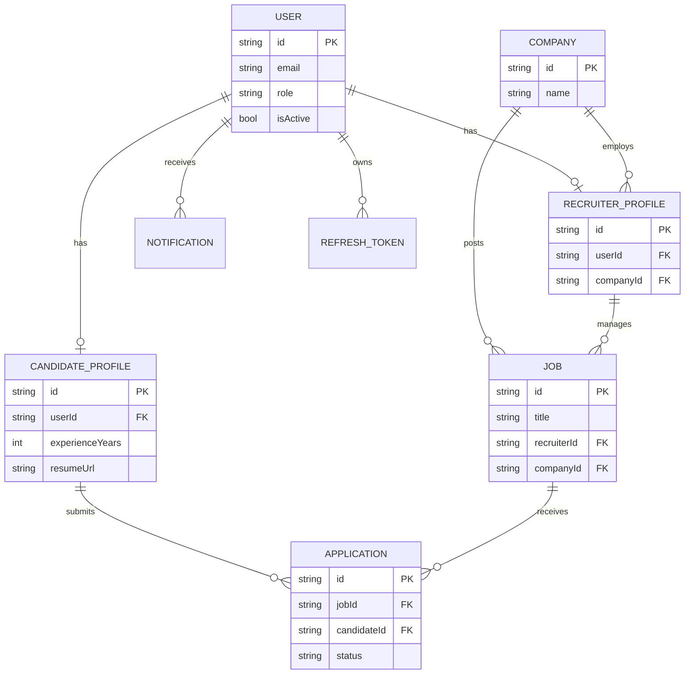

# Project Proof Pack (UML + Output Evidence)

This document is designed for review, viva, examiner, and publication-proof submission.

## 1. Use Case Diagram


## 2. Class Diagram (Logical)


## 3. Candidate Application Sequence Diagram


## 4. Recruiter Copilot Activity Diagram


## 5. Deployment Diagram


## 6. ER Diagram (Submission-Friendly)


## 7. Output Evidence Checklist (Screenshots)
Add these files under `docs/proof-assets/images/`.

| # | Proof Item | Suggested File |
|---|---|---|
| 1 | Login page with role-ready credentials | `01-login-page.png` |
| 2 | Candidate dashboard after login | `02-candidate-dashboard.png` |
| 3 | Resume upload + analysis output | `03-resume-analysis.png` |
| 4 | Job recommendations with scores | `04-job-recommendations.png` |
| 5 | Eligibility report with ATS threshold | `05-eligibility-report.png` |
| 6 | Auto-apply confirmation modal | `06-auto-apply-confirmation.png` |
| 7 | Recruiter job creation section | `07-recruiter-create-job.png` |
| 8 | Recruiter copilot ranking output | `08-recruiter-copilot-ranking.png` |
| 9 | Job scam risk output | `09-scam-risk-report.png` |
| 10 | Admin monitoring panel | `10-admin-monitoring.png` |
| 11 | Admin research evaluation panel | `11-admin-research-evaluation.png` |
| 12 | API health proof (Postman/curl) | `12-api-health-postman.png` |
| 13 | API auth login response proof | `13-api-auth-login-postman.png` |
| 14 | API research evaluation response proof | `14-api-research-evaluation-postman.png` |

## 8. Command Evidence (Optional but Strong)
Capture terminal outputs as screenshots for:
```bash
npm run build
npm run test
npx tsx scripts/eval.ts
curl -i http://localhost:4000/api/v1/health
```

## 9. PDF Export for Submission
You can include this proof pack in PDF by extending the generator:
- Source: `docs/PROJECT_PROOF_PACK.md`
- Existing generator script: `scripts/generate-doc-pdf.mjs`

If needed, create a second PDF from this markdown and attach both:
- `docs/FULL_PROJECT_DOCUMENTATION.pdf`
- `docs/PROJECT_PROOF_PACK.pdf`
